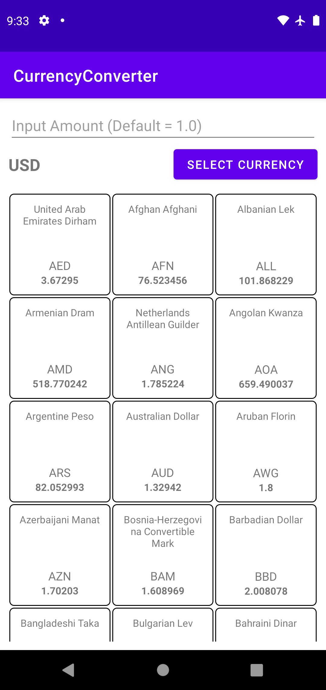
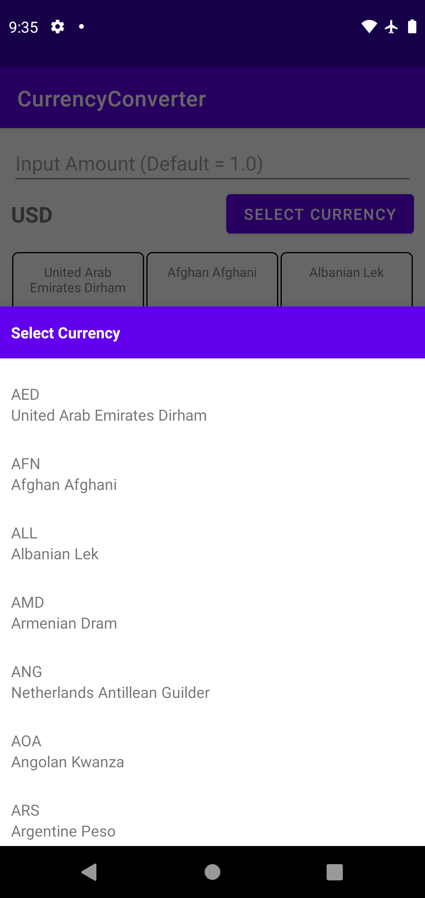

# CurrencyConverter

A simple Android app that use https://currencylayer.com/documentation apis to calculate and display currency exchange rates

## Screenshots

## Features

- Fetch api from currencylayer
- Display list of currency exchange rate
- Can input amount
- Can select currency code

## Requirements

- Android 5.0 (API Level 21) or above
- Network connection

## Environment Setting

If you want to use your own API key, please modify [gradle/environment.gradle](./gradle/environment.gradle)

## Permission

- `android.permission.INTERNET`: for fetching api

## Major Dependencies

- [Hilt](https://dagger.dev/hilt/)
- [Kotlinx Serialization](https://github.com/Kotlin/kotlinx.serialization)
- [Retrofit](http://square.github.io/retrofit)
- [Data Binding](https://developer.android.com/topic/libraries/data-binding/index.html)
- [Espresso](https://developer.android.com/training/testing/espresso)
- [Mock Webserver](https://github.com/square/okhttp/tree/master/mockwebserver)
- [MockK](https://mockk.io/)
- [Strikt](https://strikt.io/)

## Algorithm

Since the requirement is to use free apis. It doesn't support `source` and `currencies` query parameters.

So we have to fetch data from `/list` and `/live` endpoints then calculate exchange rates at client side.

The calculation will be:
`source rate / target rate * amount`

We need to loop through all items in `/list` and use each currency code to search `source rate` in `/live`

Room is used to persist data to local database and it can fetch data as list

If search source rate in list, then we need to do nested for loop. The time complexity will be O(n^2)

For better optimization, convert `/live` data to hash map before looping. Then time complexity is O(n)
